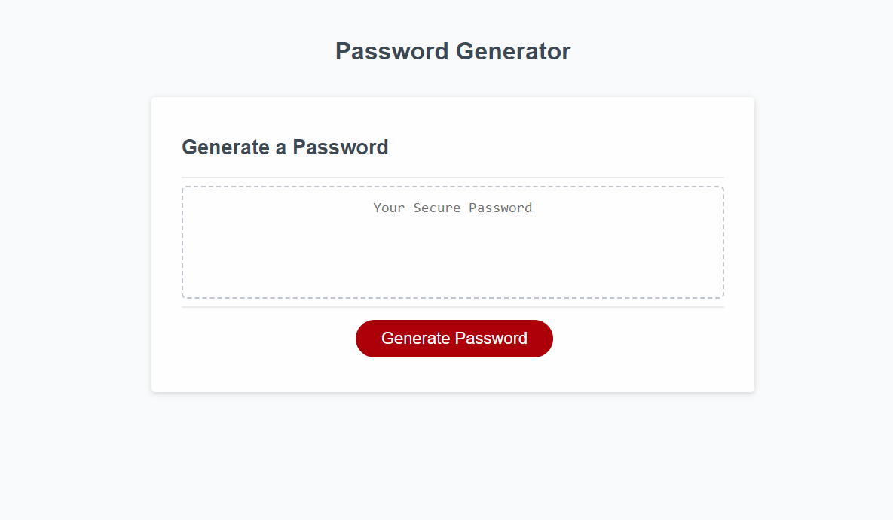

## Description

// The scope of this project is to create a responsive interface HTML, JavaScript and CSS. The user will follow prompts to generate a random password. The randomly generated password will feature a combination of numbers, upper and lowercase letters and special characters.

## Project URL

https://github.com/csherman177/PasswordGenerator

## Deployment

https://csherman177.github.io/PasswordGenerator/

## Demo/Screenshots

  <table>
  <tr>
    <td>Password Generator Screenshot</td>
  </tr>
  <tr>
    <td></td>
  </tr>
  </table>
 
  ## Contact
  Email: csherman177@gmail.com

## Author

Author(s): Courtney Sherman
GitHub: https://github.com/cspengler0024/
